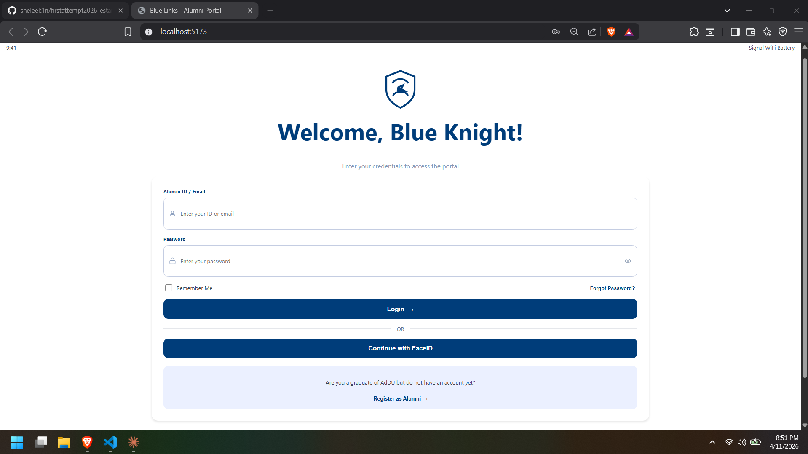
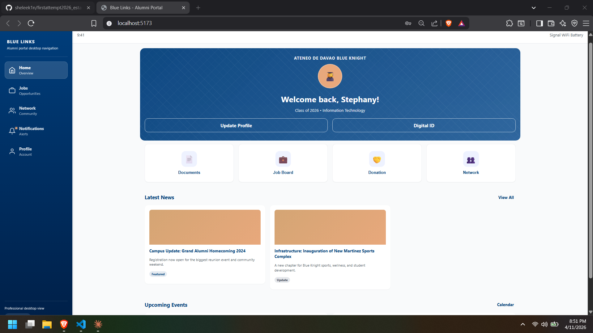
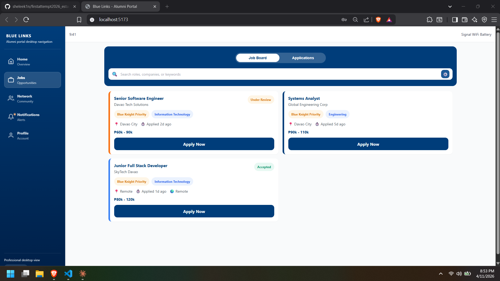
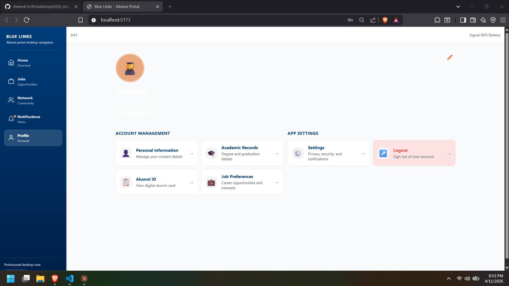
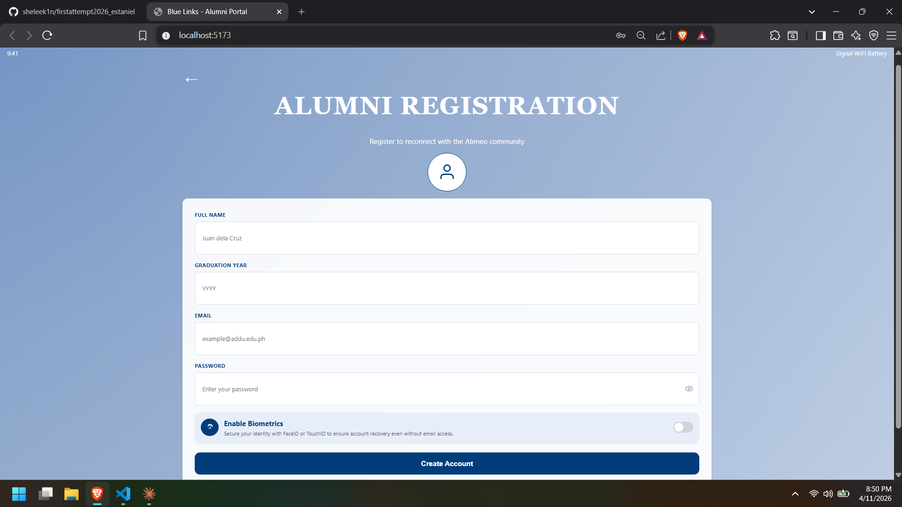
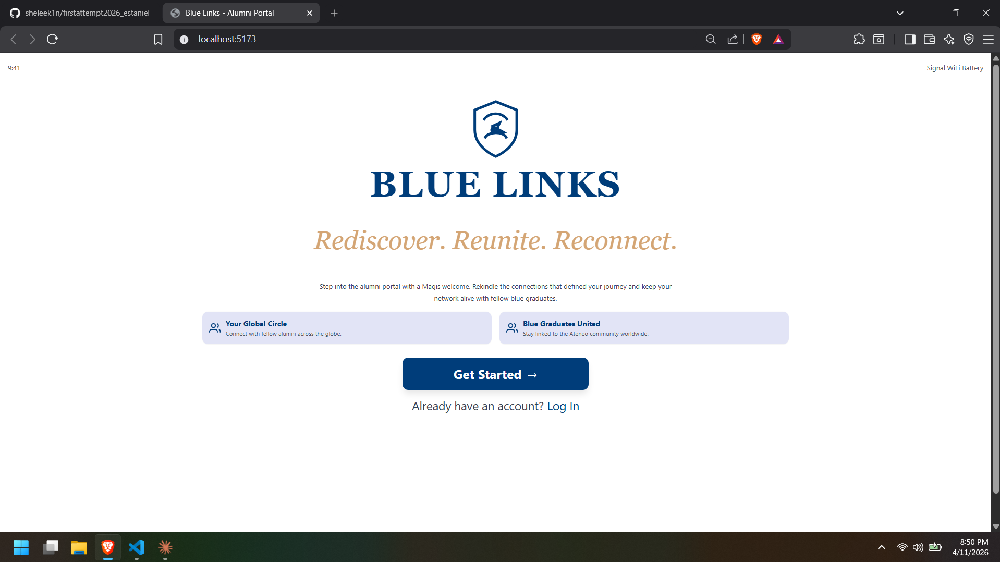
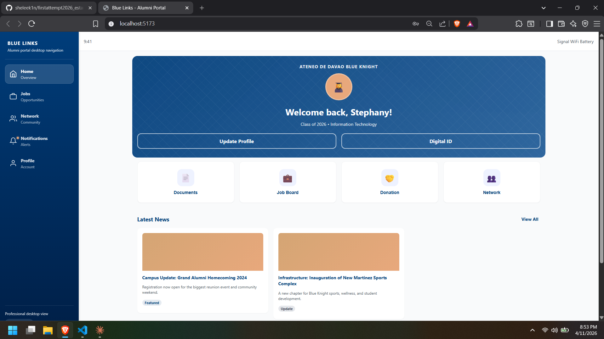
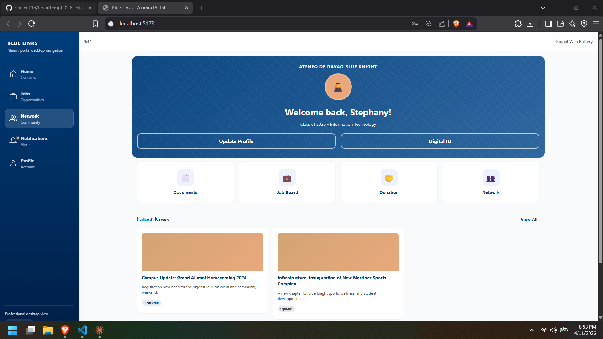
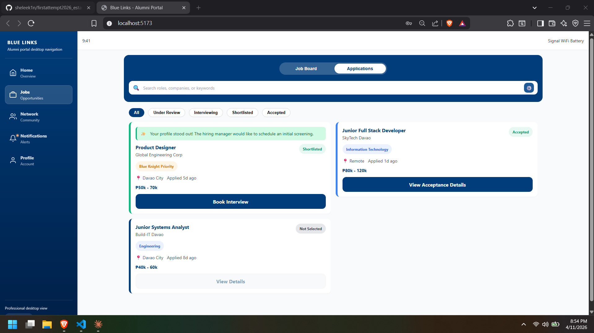
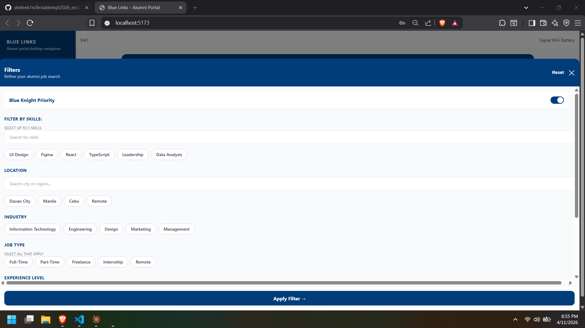

# Blue Links Alumni Portal

#### Framework: Lit + Vite + TypeScript

#### Module: Alumni Portal / Document Request Experience

## Overview

Blue Links is a mobile-style alumni portal built with Lit. It includes a welcome screen, login and signup flows, a home dashboard, a job board with filters, a profile page, and a fixed bottom navigation bar for the main sections of the app.

## Features

- Welcome screen with branding and entry actions for login and signup.
- Authentication pages for logging in and creating an account.
- Home dashboard with shortcuts, news, events, and user information.
- Job board with searchable listings, status tabs, and a filter modal.
- Profile page with account actions and logout flow.
- Bottom tab navigation for jobs, network, home, notifications, and profile.

## Tech Stack

- Lit
- TypeScript
- Vite

## Installation

To run this project on Windows PowerShell:

```bash
git clone https://github.com/sheleek1n/firstattempt2026_estaniel.git
cd firstattempt2026_estaniel
npm install
npm run dev
```

Before running the project, check if Node.js and npm are already installed:

```bash
node -v
npm -v
```

If both commands return versions, you can skip installation and continue with npm install and npm run dev.

If Node.js is not installed, run:

```bash
winget install OpenJS.NodeJS.LTS
```

## Build

```bash
npm run build
```

## Project Structure

- `src/app.ts` - main app shell and route handling.
- `src/components/pages/` - welcome, login, signup, home, job board, and profile pages.
- `src/components/layout/` - shared layout components like the bottom tab bar.
- `src/components/modals/` - interactive modal components.
- `src/components/common/` - reusable UI pieces such as buttons, badges, cards, and inputs.
- `src/utils/` - router, store, and validation helpers.
- `src/styles/design-system.css` - global design tokens and styling foundation.

## Screenshots


1. Login Page



2. Home Dashboard (Desktop)



3. Job Board (Desktop)



4. Profile Page (Desktop)



5. Signup Page



Additional captures in project root:

1. Welcome Page (Desktop)



2. Home Dashboard (Alt 1)



3. Home Dashboard (Alt 2)



4. Job Board Applications (Desktop)



5. Job Board Filter Modal (Desktop)



## AI Tools

1. Claude (Premium) (Haiku 4.5)
2. VS Code GitHub Copilot(Auto)

## Activity #14 - AI-Assisted Coding and a public Github Repo Prompt
1st prompt(claude):
if i have a figma i want to apply it to copilot how will you want it to sent it to you so you can generate a prompt ?

2nd prompt(claude) :
***sent images to from figma to claude***
-note that this is simple web app using (Lit JS) as framework

reply: claude generate 1-8 modules prompt

3rd prompt(copilot)
-sent images from figma + pasted 1st module until 8th module.

## Activity #14
Master Prompt
-pasted whole instruction + give me step by step guide me

##AI Hallucinations & Manual Fixes
-created it and placed it in /public
-downloaded and added my own icons
-fixed them based on my actual folder structure

## PWA Update (Apr 23, 2026)

This project was upgraded to a Progressive Web App (PWA) with university branding and offline support.

### What was added/updated

- **Web App Manifest**
  - File: `public/manifest.json`
  - Includes: app name, short name, description, start URL, display mode, theme/background colors, orientation, and icons.
- **Branding Icons**
  - Files:
    - `public/icons/icon-192.svg`
    - `public/icons/icon-512.svg`
  - These are used for install prompts and home screen icons.
- **Service Worker Registration**
  - File: `src/app.ts`
  - Registers `/sw.js` in production builds.
- **PWA Build Integration**
  - File: `vite.config.ts`
  - Added `vite-plugin-pwa` with `generateSW` so service worker and precache list are generated automatically during build.
- **App Metadata in HTML**
  - File: `index.html`
  - Added manifest link, theme color, favicon, and apple touch icon tags.

### Caching strategy used

- **Precache (build-time):** app shell/build assets for fast startup.
- **Network First (documents/pages):** fresh content when online, offline fallback when disconnected.
- **Stale While Revalidate (JS/CSS/fonts):** instant cached response with background updates.
- **Cache First (images/icons):** faster repeated loads and reduced bandwidth.

### How to verify PWA behavior

```bash
npm install
npm run build
npm run preview
```

Then open the app in browser and verify:
- Install prompt/icon is available.
- App opens in standalone mode after install.
- Reload remains fast after first visit.
- App still opens when offline (after initial load/build cache).